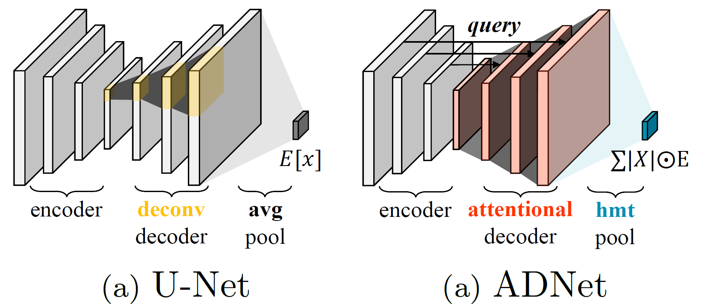

# ADNet

This repository contains PyTorch-based implementation for "Attentional Decoder Networks for Chest X-ray Image Recognition on High-resolution Features." Our ADNet aims to enhance chest X-ray performance via a lightweight attentional decoder network and harmonic magnitude transforms. We provide model, training, and evaluation (supervised, `k`-NN classifier) code as well as pre-trained weight in the hope that researchers and practitioners widely use our works effortlessly.

<p align="center">
    
    <br/>
  <h4 align="center">Method Overview of Attentionl Decoder Network</h4>
</p>

## Tutorial

### 1️⃣ [Inference Only]

1. Copy [mecla/model/convnext.py](mecla/model/convnext.py) into your project root folder.

2. Install `timm==0.6.2` and run the following code snippets. We provide the following models with checkpoints.

   - Model Name patterns: `[resnet50|convnext_tiny]_ADNet_[Dataset Name]`
   - Dataset Name: `IN1K`, `IN1K_NIH`, `IN1K_MIMIC`, `IN1K_CheXpert`, `ALL`, `ALL_NIH`, `ALL_MIMIC`, `ALL_CheXpert`.
   
   ```python
   !wget -nc https://raw.githubusercontent.com/Lab-LVM/ADNet/main/mecla/model/convnext.py
   !wget -nc https://raw.githubusercontent.com/Lab-LVM/ADNet/main/misc/sample.png
   import convnext
   from timm import create_model
   from PIL import Image
   from torchvision.transforms import Compose, Resize, CenterCrop, Normalize, ToTensor, Grayscale
   
   img = Image.open('sample.png')
   x = Compose([
       Grayscale(3), Resize(472, 3), CenterCrop(448), ToTensor(), 
       Normalize((0.485, 0.456, 0.406), (0.229, 0.224, 0.225))
   ])(img)
   model = create_model('convnext_tiny_ADNet_ALL_NIH', num_classes=14, pretrained=True)
   model.eval()
   y = model(x.unsqueeze(0)).argmax()
   print(y)
   # output: tensor(1) (cardiomegaly)
   ```
   
   

### 2️⃣ [Train]

1. Clone this repository and install the dependency.

   ```bash
   git clone https://github.com/Lab-LVM/ADNet
   pip install -r requirements.txt
   ```
   
2. Download chest X-ray datasets and change `data_dir` in `config/train.json` .

   ```json
   "data_dir": {
     "chexpert": "/path/to/CheXpert-v1.0-small/",
     "nihchest": "/path/to/nih/",
     "mimic": "/path/to/mimic-cxr/",
   }
   ```

   You can download each dataset using the provided URLs, and the dataset directory looks like the below:

   *Tip.*

   - We resize images to 384x384 resolution using [misc/resize_chexpert.py](misc/resize_chexpert.py).
   - We split MIMIC-CXR using [CheXclusion](https://github.com/LalehSeyyed/CheXclusion) protocols. You can download the test patient ID lists from [here](https://github.com/LalehSeyyed/CheXclusion/blob/main/MIMIC/testSet_SubjID.csv).

   ```bash
   # 1. CheXpert: https://stanfordmlgroup.github.io/competitions/chexpert/
   CheXpert-v1.0-small
   ├── train
   ├── train.csv
   ├── valid
   └── valid.csv
   
   # 2. MIMIC-CXR: https://physionet.org/content/mimic-cxr/2.0.0/
   mimic-cxr
   ├── files
   ├── img_384
   ├── test_x.json
   ├── test_y.json
   ├── train_x.json
   └── train_y.json
   
   # 3. https://www.kaggle.com/datasets/nih-chest-xrays/data
   nih
   ├── Data_Entry_2017.csv
   ├── img_384
   ├── test_list.txt
   └── train_val_list.txt
   ```

3. Run the following command.

   - Download a pre-trained checkpoint and modify the checkpoint path of `model_weight` in [config/train.json](config/train.json). You can choose a checkpoint depending on pre-trained dataset types: ImageNet or ALL (NIH+MIMIC+CheXpert).
   
     | No   | Backbone   | IN1K                                                         | ALL                                                          |
     | ---- | ---------- | ------------------------------------------------------------ | ------------------------------------------------------------ |
     | 1    | ResNet50   | [ckpt](https://github.com/Lab-LVM/ADNet/releases/download/v0.0.1/resnet50_ADNet_IN1K.pth.tar) | [ckpt](https://github.com/Lab-LVM/ADNet/releases/download/v0.0.1/resnet50_ADNet_ALL.pth.tar)  [log](https://github.com/Lab-LVM/ADNet/releases/download/v0.0.1/resnet50_ADNet_ALL.txt) |
     | 2    | ConvNeXt-T | [ckpt](https://github.com/Lab-LVM/ADNet/releases/download/v0.0.1/convnext_tiny_ADNet_IN1K.pth.tar) | [ckpt](https://github.com/Lab-LVM/ADNet/releases/download/v0.0.1/convnext_tiny_ADNet_ALL.pth.tar)  [log](https://github.com/Lab-LVM/ADNet/releases/download/v0.0.1/convnext_tiny_ADNet_ALL.txt) |
   
   - See more training scripts in [script/supervised/](script/supervised).
   
   - See available training settings in [config/train.json](config/train.json).
   
   - Add `--use-wandb` for watching progress in [wandb](https://wandb.ai/).
   
   ```bash
   # pattern: python3 train.py -c [GPU Device] -s [Setting Name] -m [Model Name]
   python3 train.py -s nihchest -c 1 -m convnext_tiny_ADNet_IN1K
   ```
   
   


## Experiment Result

We provide experiment results with pre-trained checkpoints.

| Pre-train Data | Fine-tune Data | Backbone   | Image | AUROC | Download                                                     |
| -------------- | -------------- | ---------- | ----- | ----- | ------------------------------------------------------------ |
| IN1K           | NIH            | ResNet50   | 448   | 83.5  |                                                              |
| IN1K           | NIH            | ConvNeXt-T | 448   | 83.8  | [ckpt](https://github.com/Lab-LVM/ADNet/releases/download/v0.0.1/convnext_tiny_ADNet_IN1K_NIH.pth.tar)  [log](https://github.com/Lab-LVM/ADNet/releases/download/v0.0.1/convnext_tiny_ADNet_IN1K_NIH.txt) |
| IN1K           | MIMIC          | ResNet50   | 256   | 84.5  |                                                              |
| IN1K           | MIMIC          | ConvNeXt-T | 416   | 85.3  | [ckpt](https://github.com/Lab-LVM/ADNet/releases/download/v0.0.1/convnext_tiny_ADNet_IN1K_MIMIC.pth.tar)  [log](https://github.com/Lab-LVM/ADNet/releases/download/v0.0.1/convnext_tiny_ADNet_IN1K_MIMIC.txt) |
| IN1K           | CheXpert       | ResNet50   | 256   | 90.6  |                                                              |
| ALL            | NIH            | ResNet50   | 448   | 84.1  | [ckpt](https://github.com/Lab-LVM/ADNet/releases/download/v0.0.1/resnet50_ADNet_ALL_NIH.pth.tar)  [log](https://github.com/Lab-LVM/ADNet/releases/download/v0.0.1/resnet50_ADNet_ALL_NIH.txt) |
| ALL            | NIH            | ConvNeXt-T | 448   | 84.4  | [ckpt](https://github.com/Lab-LVM/ADNet/releases/download/v0.0.1/convnext_tiny_ADNet_ALL_MIMIC.pth.tar)  [log](https://github.com/Lab-LVM/ADNet/releases/download/v0.0.1/convnext_tiny_ADNet_ALL_MIMIC.txt) |
| ALL            | MIMIC          | ResNet50   | 448   | 85.2  | [ckpt](https://github.com/Lab-LVM/ADNet/releases/download/v0.0.1/resnet50_ADNet_ALL_MIMIC.pth.tar)  [log](https://github.com/Lab-LVM/ADNet/releases/download/v0.0.1/resnet50_ADNet_ALL_MIMIC.txt) |
| ALL            | MIMIC          | ConvNeXt-T | 448   | 85.6  | [ckpt](https://github.com/Lab-LVM/ADNet/releases/download/v0.0.1/convnext_tiny_ADNet_ALL_MIMIC.pth.tar)  [log](https://github.com/Lab-LVM/ADNet/releases/download/v0.0.1/convnext_tiny_ADNet_ALL_MIMIC.txt) |

*Note*

- In the pre-train dataset column, ALL means a dataset combined by NIH, MIMIC, and CheXpert using [misc/combine_datasets.py](misc/combine_datasets.py).
- We run our experiments on `Ubuntu 18.04 LTS`, `CUDA 11.03`, and a single NVIDIA RTX 3090 24GB GPU.


## Acknowledgment

Our code is based on the [TIMM library](https://github.com/huggingface/pytorch-image-models).
